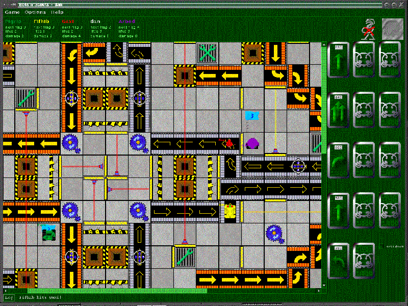
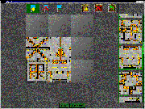
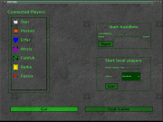
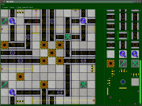

# botsnscouts

  

## Run
If you've got Apache Ant installed, it should be possible to start the current development state of the game by changing into the "bns" folder and executing "ant run".

## Develop
The sourcecode can be found in the bns folder.

Or rather:

"bns" is (among other things..) the source folder, with "de" being the main package which contains all the Java sources.

## Changelog

Tried to migrate our ancient sourceforge CVS repo to git(hub) from

https://sourceforge.net/projects/botsnscouts/

Seems to have worked.
